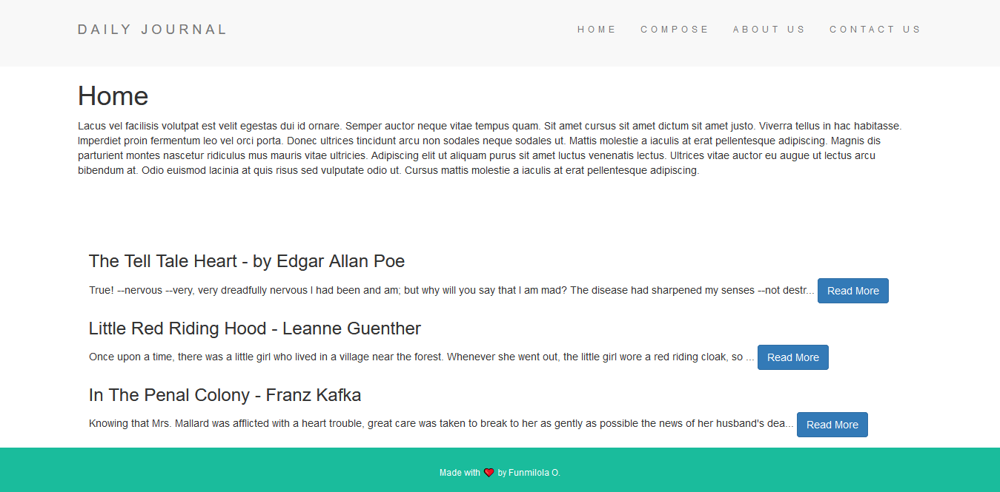
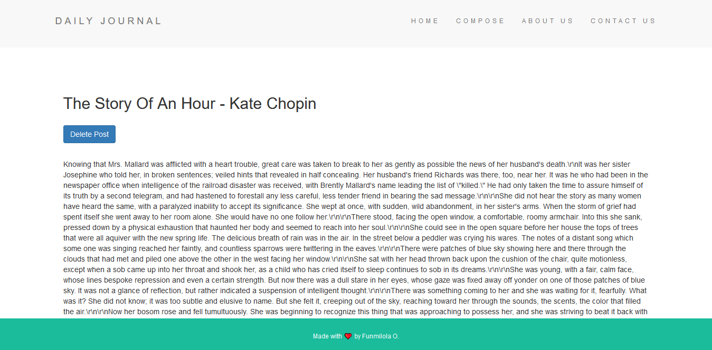
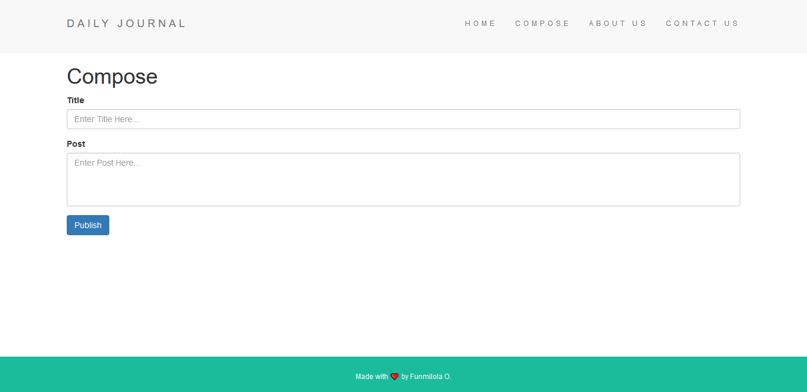

# Project Name  

> An online daily journal site.

## Table of contents  

- [General info](#general-info)
- [Screenshots](#screenshots)
- [Technologies](#technologies)
- [Setup](#setup)
- [Features](#features)
- [Status](#status)
- [Inspiration](#inspiration)
- [Contact](#contact)

## General info  

This is an online daily journal built with EJS, NodeJS, ExpressJS, MongoDB and Mongoose. It fetches created posts from a MongoDB collection and displays it to the user on load, the user can create posts, view them on the home page and also delete them.

## Screenshots  

## Technologies  

- Body Parser - version 1.19.0
- EJS - version 2.7.4
- Express - version 4.17.1
- Lodash - version 4.17.20
- MongoDB - version 3.6.2
- Mongoose - version 5.10.7
- Morgan - version 1.10.0

## Setup  

Visit [Daily Journal](https://dailyjournaal.herokuapp.com/) in your browser.

## Features  

- Reading Posts
- Creating New Posts
- Deleting Posts

## Status  

Project is: _finished_

## Inspiration  

Project was inspired by a challenge from a udemy course.

## Contact  

Created by [@funmilolajire](mailto:funmilolajire@gmail.com) - feel free to contact me!  

